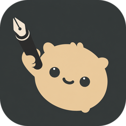

<p align="center">
  
</p>

# critter

Pick an element, draw and comment on it, then copy a screenshot or a text note. Build for design crits or prototype demos to get screenshot-able feedback directly in your clipboard.

Inspired by Aiden Bai's [react-grab](https://github.com/aidenybai/react-grab).

The build is one file, `dist/crit.js`. Put it on a page with a script tag. This is not an npm package.

## Try it

```
pnpm install
pnpm dev
```

Open the URL Vite prints. The left window is a sample app you can pick. The right panel shows whatever you copy, image or text, so you can inspect the clipboard without leaving the page.

A demo runs on load. Click to stop it. `Play demo` starts it again.

Only the left window is pickable: it carries `data-crit-scope`, and the rest of the page uses `data-crit-ignore`, the same attributes a host app puts on its own chrome.

## Build

```
pnpm build
```

Writes `dist/crit.js`. React is inside the file, with no runtime imports. `pnpm type-check` runs `tsc --noEmit`.

Serve the repo root and open `script-tag.html` to load the built file from a script tag.

## Add it to an app

1. `pnpm build`, then copy `dist/crit.js` into the app's public folder. On Vite or Next that is `public/crit.js`.
2. Add this before `</body>`, with a path that matches where you put the file:

   ```html
   <script src="/crit.js"></script>
   ```

   Next App Router: put the tag in the root layout. Next Pages Router: `<Script src="/crit.js" strategy="lazyOnload" />`.
3. Reload over http(s), not `file://`. Toggle with ⌘⇧. on macOS or Ctrl+Shift+. on Windows and Linux, or click the tab at the bottom of the page.

## Chrome extension

For sites whose code you cannot change:

```
pnpm build:ext
```

Open `chrome://extensions`, turn on Developer mode, Load unpacked, and pick the `extension/` folder. The toolbar button toggles picking on the current http(s) tab. After that, the in-page shortcut and bottom tab work as usual. The script runs in the page's main world, so React component names still come from fibers.

## Using it

Toggle with the shortcut or the tab at the edge of the page. Esc leaves. The gear on the dock changes the shortcut.

Hover to highlight, click to pin. Then drag on the page to draw, and type what is wrong. Backspace undoes the last stroke. Untick "Include drawing" to keep strokes out of the screenshot.

Press C for comment mode instead: click anywhere to drop a numbered pin and write a note. The dock copies or downloads every pin at once.

Copy is two buttons, one flavor each. Paste one or the other, never both, because Notion and friends keep one and drop the rest.

- **Image** is a PNG of the viewport. Whatever you wrote goes in a caption bar at the bottom, with the page URL.
- **Text** is `text/html` and `text/plain`: your comment, then the component, selector, viewport, URL, and the element's HTML.

Copying leaves the pin open so you can take the other flavor too. Download saves the same PNG under a timestamped name. X or Esc closes.

## Host attributes

`data-crit-ignore` on a node skips that node and everything inside it during hit-testing.

`data-crit-bounds` on a container docks the toolbar to that box instead of the viewport. Set it to `top`, `bottom`, `left`, or `right` for the starting edge. After someone drags the toolbar, that choice is remembered.

`data-crit-scope` on a container keeps picking and pinning inside that box. Outside it the pointer behaves normally: page cursor, no highlight, clicks land where you aimed them. The playground puts this on the left window.
